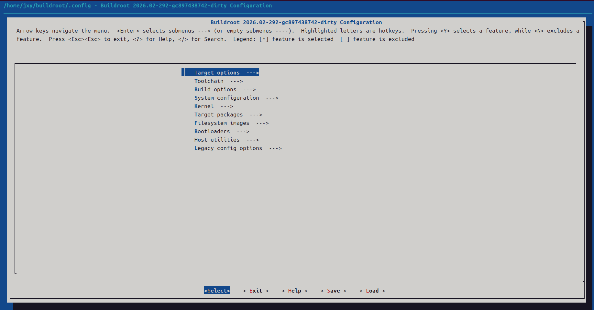
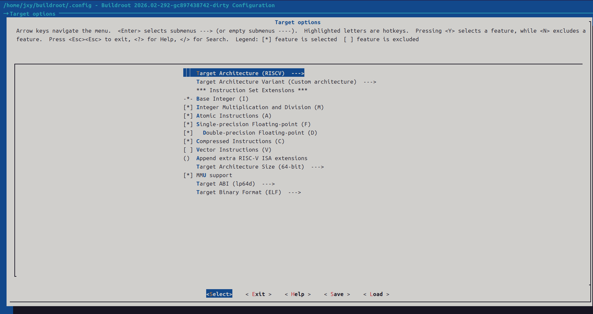
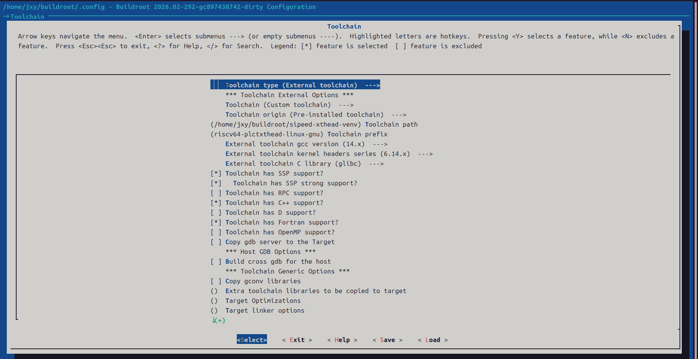
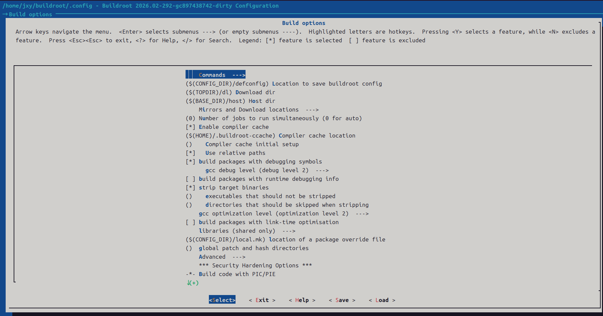
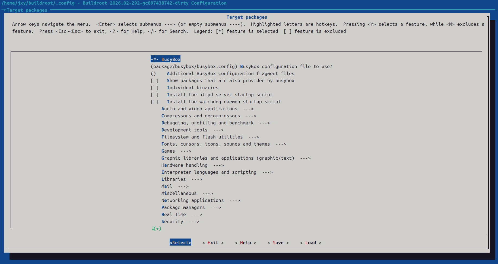
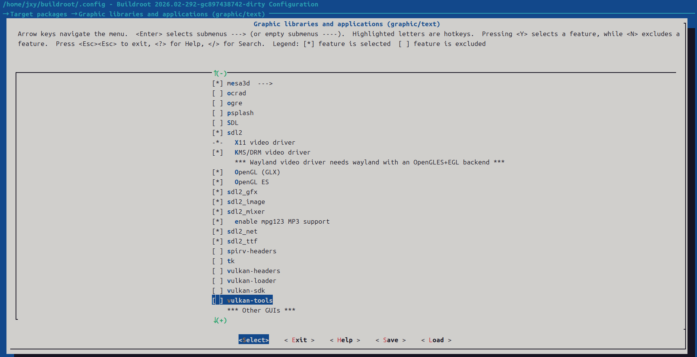
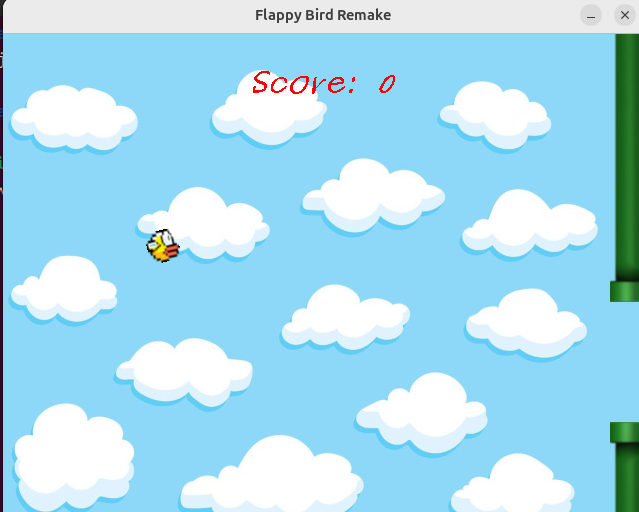

使用 RuyiSDK 创建虚拟环境编译并游玩 Flappy Bird

本文介绍基于 RuyiSDK 创建 RISC-V 虚拟环境，搭配 Buildroot 制作含 SDL2 的 sysroot，交叉编译 Flappy Bird 游戏，最终通过 ruyi-qemu 在主机上运行游玩的完整流程，实现无开发板跨平台编译验证。

## 开始

获取项目:
```
git clone https://github.com/phoemur/flappy.git

cd flappy
```

## 使用 buildroot 制作 sysroot

获取 buildroot 工具
```
cd ~

git clone https://github.com/buildroot/buildroot.git

cd ./buildroot
```
### 使用 RuyiSDK 创建虚拟环境
```
ruyi venv -t gnu-plct-xthead -e qemu-user-riscv-xthead sipeed-lpi4a ./sipeed-xthead-venv
```

### 使用 buildroot 和虚拟环境下的工具链制作 sysroot
```
# 激活虚拟环境
source ./sipeed-xthead-venv/bin/ruyi-activate

# 打开 buildroot 的配置界面
make menuconfig
```
界面如图：


### 配置 buildroot

- 点击 enter 进入进入Target options 子菜单界面，配置如下：



- 双 ESC 返回上一级，对 Toolchain 和 Target options 分别进行如下配置：





- 进入 Target packages 可以配置某些包是否安装，如 sdl2 等等：





- 保存并退出 menuconfig 界面后，具体的配置将对应 buildroot 目录下 .config 文件

最终的 .config 文件参见：[配置文件](./file/.config)

- 开始制作，需要等待一段时间

```
make
```
## 编译并运行项目
- 进入 flappy 项目文件夹

```
cd flappy

# 激活虚拟环境
source ~/buildroot/sipeed-xthead-venv/bin/ruyi-activate 
```
- 在 flappy 项目文件夹创建 toolchain.cmake 文件，方便编译，内容如下：

```
set(CMAKE_SYSTEM_NAME Linux)
set(CMAKE_SYSTEM_PROCESSOR riscv64)

set(CMAKE_C_COMPILER "/home/jxy/buildroot/sipeed-xthead-venv/bin/riscv64-plctxthead-linux-gnu-gcc")
set(CMAKE_CXX_COMPILER "/home/jxy/buildroot/sipeed-xthead-venv/bin/riscv64-plctxthead-linux-gnu-g++")

set(CMAKE_SYSROOT "/home/jxy/buildroot/output/staging")
set(CMAKE_FIND_ROOT_PATH "/home/jxy/buildroot/output/staging")

set(CMAKE_FIND_ROOT_PATH_MODE_PROGRAM NEVER)
set(CMAKE_FIND_ROOT_PATH_MODE_LIBRARY ONLY)
set(CMAKE_FIND_ROOT_PATH_MODE_INCLUDE ONLY)
set(CMAKE_FIND_ROOT_PATH_MODE_PACKAGE ONLY)

set(PKG_CONFIG_EXECUTABLE "/home/jxy/buildroot/output/host/bin/pkg-config")
set(ENV{PKG_CONFIG_SYSROOT_DIR} ${CMAKE_SYSROOT})
set(ENV{PKG_CONFIG_PATH} "${CMAKE_SYSROOT}/usr/lib/pkgconfig")
```
- 开始编译

```
cmake -S . -B build \
      -DCMAKE_TOOLCHAIN_FILE=$PWD/toolchain.cmake

cmake --build build
```
- 运行游玩

```
env SDL_AUDIODRIVER=dummy LIBGL_ALWAYS_SOFTWARE=1 ruyi-qemu -L /home/jxy/buildroot/output/staging ./flappy
```


