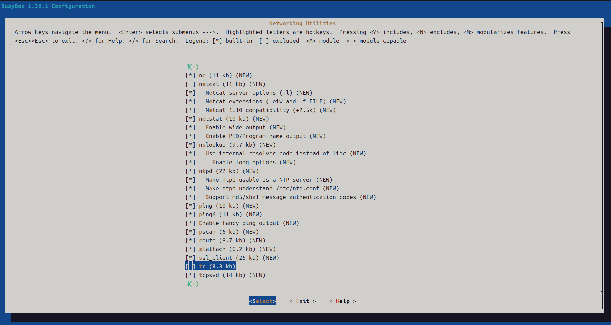
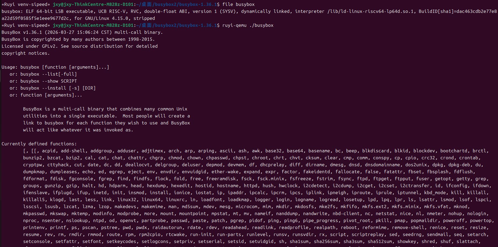
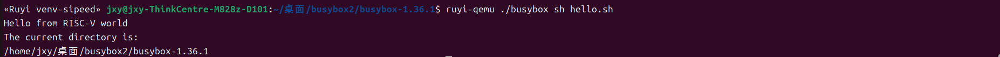

RuyiSDK 实践指南：基于 RISC-V 架构编译与运行 Busybox

本文档通过完整可复现的实操流程，以轻量级工具集项目 Busybox 为实践载体，手把手指导用户完成 RuyiSDK 虚拟环境部署、RISC-V 架构交叉编译、QEMU 模拟器运行二进制文件的全流程操作。
核心目的是让用户快速掌握 RuyiSDK 的基础使用方法，同时直观了解 Busybox 作为嵌入式系统核心工具集的功能特性，完成从源码获取、环境配置、编译构建到模拟器验证的嵌入式开发全链路实践。

### 获取 Busybox 项目
```
wget https://busybox.net/downloads/busybox-1.36.1.tar.bz2

tar -xjf busybox-1.36.1.tar.bz2

cd busybox-1.36.1
```
本步骤完成 Busybox 源码的下载与解压，进入项目根目录，为后续编译做准备。Busybox 是集成了百余条 Linux 常用命令的轻量级工具集，是嵌入式系统的核心组件。
### 使用 RuyiSDK 创建虚拟环境
```
# 创建虚拟环境
# -t 指定工具链，-e 指定模拟器，sipeed-lpi4a 是 profile，venv -sipeed 是虚拟环境的名称
ruyi venv -t gnu-plct-xthead sipeed-lpi4a -e qemu-user-riscv-xthead venv-sipeed

# 激活虚拟环境
./venv-sipeed/bin/ruyi-activate
```
### 编译项目
```
make ARCH=riscv CROSS_COMPILE=riscv64-plctxthead-linux-gnu- menuconfig

make ARCH=riscv CROSS_COMPILE=riscv64-plctxthead-linux-gnu- -j$(nproc)
```
如果发生error:`networking/tc.c:255:16: error: 'TCA_CBQ_LSSOPT' `禁用 tc 组件:


通过 Makefile 指定架构为 RISC-V，调用 RuyiSDK 虚拟环境中的交叉编译器，打开图形化配置界面完成 Busybox 编译配置，生成适配 RISC-V 架构的编译配置文件,然后开始编译。
### 得到 busybox,可使用虚拟环境的 qemu 模拟器运行得到的二进制产物
```
# 检查 busybox 个格式信息
file busybox

# 打印 BusyBox 的帮助信息和支持的命令列表
ruyi-qemu ./busybox
```



编译完成后生成 RISC-V 架构的 busybox 二进制文件，通过` file `命令验证文件架构格式，使用 RuyiSDK 内置的` ruyi-qemu `模拟器直接运行程序，查看 Busybox 支持的命令集。
### 尝试运行内置的 Shell
```
echo "echo 'Hello from RISC-V world'" > hello.sh
echo "echo 'The current directory is:'" >> hello.sh
echo "pwd" >> hello.sh

ruyi-qemu ./busybox sh hello.sh
```

编写简易 Shell 脚本，通过 Busybox 内置的 Shell 解释器，在` ruyi-qemu `模拟器中执行脚本，验证 Busybox 命令执行能力。


